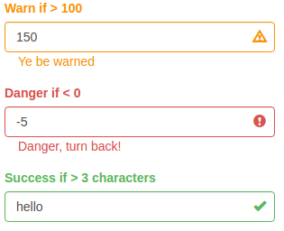

# shinyFeedback

[](https://travis-ci.org/merlinoa/shinyFeedback)

R package for displaying user feedback along side Shiny inputs

# Getting Started

```R
# install package
devtools::install_github("merlinoa/shinyFeedback", build_vignettes = TRUE)
# read intro vignette
browseVignettes(package = "shinyFeedback")
```

# Examples

- [Example App on Github](https://github.com/merlinoa/shinyFeedbackApp)

- Screenshot of shiny inputs with shinyFeedback messages displayed


