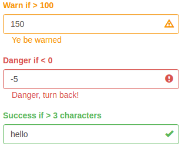

## Functionality

The `shinyFeedback` package creates a user friendly message that appears along side a `shiny` input.  Here are pictures of `shiny` inputs with feeback messages displayed:



`shinyFeedback` provides a friendly way to guide your users on how to use your app.

`shinyFeedback` currently only works with the following `shiny::*Input()` functions:

- `numericInput()`
- `textInput()`
- `passwordInput()`
- `selectInput()`

More inputs and display options will be supported in future versions of `shinyFeedback`

## Setup

In order to use `shinyFeedback` you need to include the following function at the top of your UI.

```{r, eval=FALSE}
useShinyFeedback()
```

The following is a minimal example of a `shiny` app that uses `shinyFeedback`.  Run the following code in your R console to run the app.

```{r, eval=FALSE}
library(shiny)
library(shinyFeedback)

ui <- fluidPage(
  useShinyFeedback(), # include shinyFeedback
  
  numericInput(
    "warningInput",
    "Warn if Negative",
    value = -5
  )
)

server <- function(input, output) {
  observeEvent(input$warningInput, {
    feedbackWarning(
      inputId = "warningInput",
      condition = input$warningInput < 0
    )
  })
}

shinyApp(ui, server)
```

The above app uses the `feedbackWarning()` function to display a default warning feedback message.  `feebackWarning()` is a wrapper around the more general `feedback()` function.

## The `feedback` function

The primary function provided by `shinyFeedback` is `feedback()`. `feedback()` creates messages similar to those shown in the image at the top of this vignette.  The color, icon, and text of the feedback message can be customized.

To use `feedback()`, you will want to call it from inside a `shiny` observer (either `shiny::observe()` or `shiny::observeEvent()`).

## Handy `feedback` wrappers

`shinyFeedback` has 3 convenient wrappers functions:

- `feedbackWarning()`
- `feedbackDanger()`
- `feedbackSuccess()`

The above functions provide default arguments for all the formal arguments in the `feedback` function other than `inputId` and `condition`.  A live app using these functions is available [here](https://merlinoa.shinyapps.io/shinyfeedbackapp/).

## Multiple `feedback`s

When assigning multiple `feedback()`s to a single input (e.g. you want to display a certain feedback message if the input value >= 1, and a different feedback value if the input is >= 2), place the `feedback()`s in the same `shiny` observer.  The `feedback()`s further down in the body of the observer will override the higher `feedback()`s if multiple `feedback()` function conditions evaluate to TRUE.

```{r, eval = FALSE}
ui <- fluidPage(
  useShinyFeedback(), # include shinyFeedback
  
  numericInput(
    "multiFeedbacks",
    "1 is scary 2 is dangerous", 
    value = 1
  )
)

server <- function(input, output) {
  observeEvent(input$multiFeedbacks, {
    feedbackWarning(
      inputId = "multiFeedbacks",
      condition = input$multiFeedbacks >= 1,
      text = "Warning 1 is a lonely number"
    )
    feedbackDanger(
      inputId = "multiFeedbacks",
      condition = input$multiFeedbacks >= 2,
      text = "2+ is danger"
    )
  })
}

shinyApp(ui, server)
```

In the above example, both `feedback*()` function conditions are TRUE when the input is >=2.  The `feedbackDanger()` is displayed because it is called after the `feedbackWarning()`.
